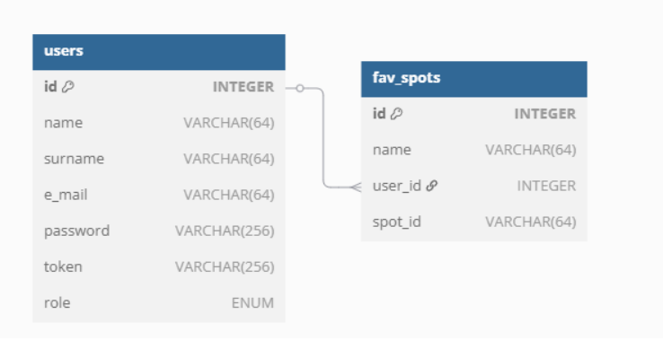
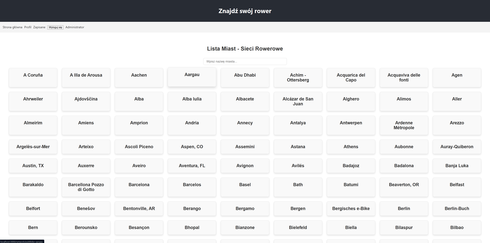
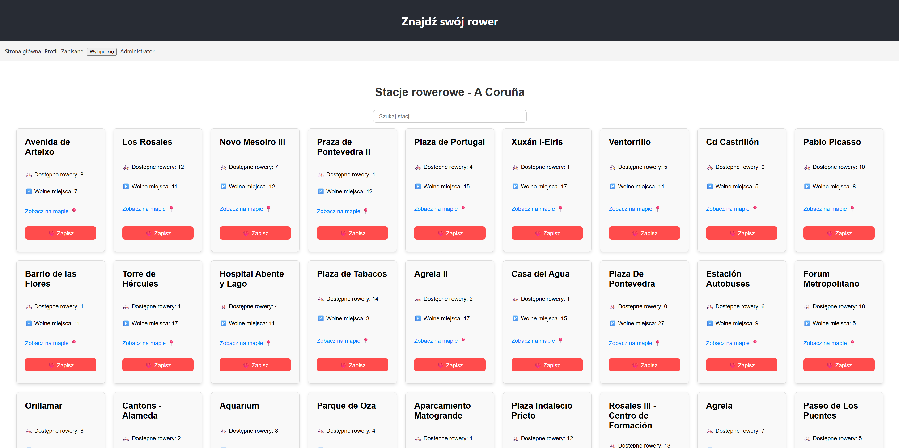
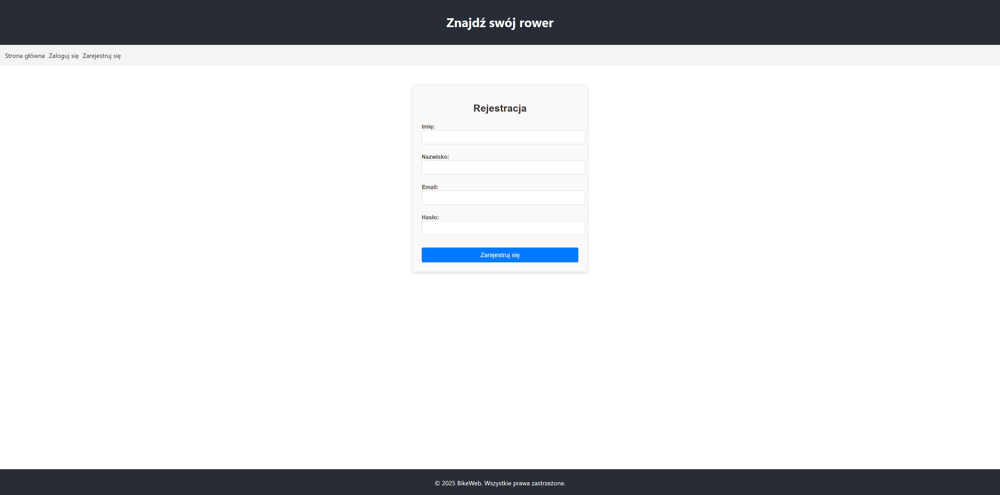
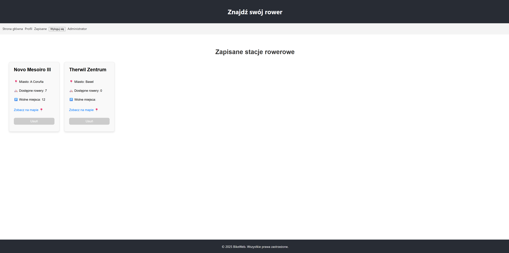
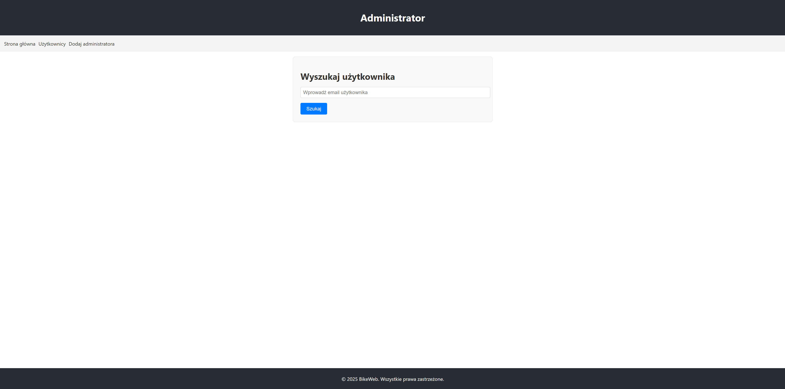
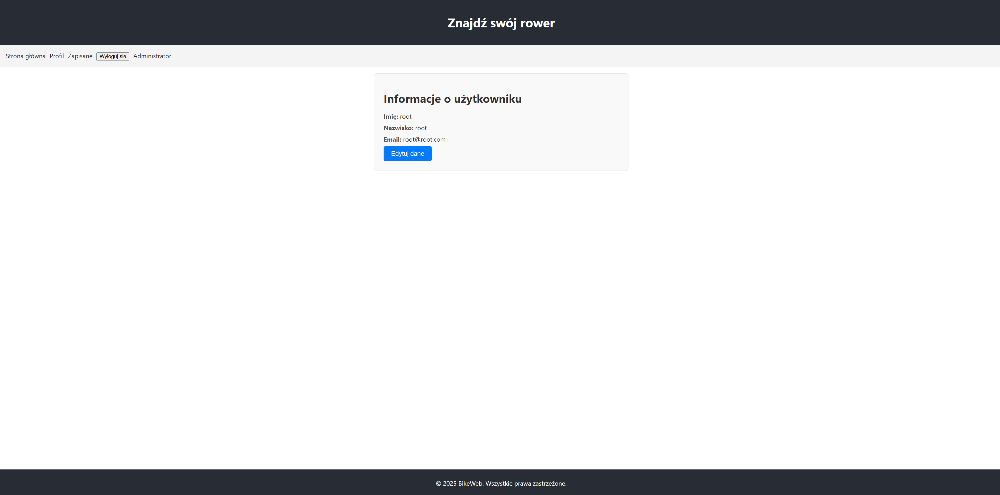

# BikeWeb

Aplikacja prezentująca stacje rowerowe na świecie z wykorzystaniem zewnętrznego API: https://api.citybik.es

## Diagram bazy danych

<p align="center">
  
</p>

## Przykładowe widoki aplikacji

<p align="center">
  
  
</p>

<p align="center">
  
  
</p>

<p align="center">
  
  
</p>

## Funkcjonalności
- wyświetlanie stacji rowerowych z API  
- logowanie i rejestracja użytkowników  
- zapisywanie ulubionych stacji do bazy danych

## Technologie
- React  
- Java Spring Boot  
- MySQL  
- Docker

# Uruchomienie

## Wymagania

- Docker Desktop (Windows/macOS) lub Docker Engine (Linux)
- Docker Compose

---

## Instalacja Dockera

### Windows / macOS
1. [Docker Desktop](https://www.docker.com/products/docker-desktop/)
2. Uruchomienie Docker Desktop i upewnienie się, że działa

### Linux
1. Instalacja Docker Engine według instrukcji dla swojej dystrybucji: [Docker Engine](https://docs.docker.com/engine/install/)
2. Instalacja Docker Compose: [Docker Compose](https://docs.docker.com/compose/install/)
3. Upewnienie się, że Docker działa:  

```bash
docker --version
docker compose version
```

## Klonowanie projektu

```bash
git clone https://github.com/kubikal7/bike_web.git
cd bike_web
```

## Uruchomienie projektu

```bash
docker compose up --build
```

## Dostęp do aplikacji

Po uruchomieniu kontenerów, aplikacja frontendowa jest dostępna w przeglądarce pod adresem:

- **Frontend (aplikacja webowa): [http://localhost:3000](http://localhost:3000)** – należy przejść na ten adres, aby korzystać z systemu (login i hasło poniżej)
- Backend API: [http://localhost:8080](http://localhost:8080)  
- Baza danych MySQL: `localhost:3307`, baza: `bike_web`, użytkownik: `root`, hasło: `root`

### Logowanie do systemu

Można zalogować się na konto administratora:

- **Login:** `root@root.com`  
- **Hasło:** `root`
